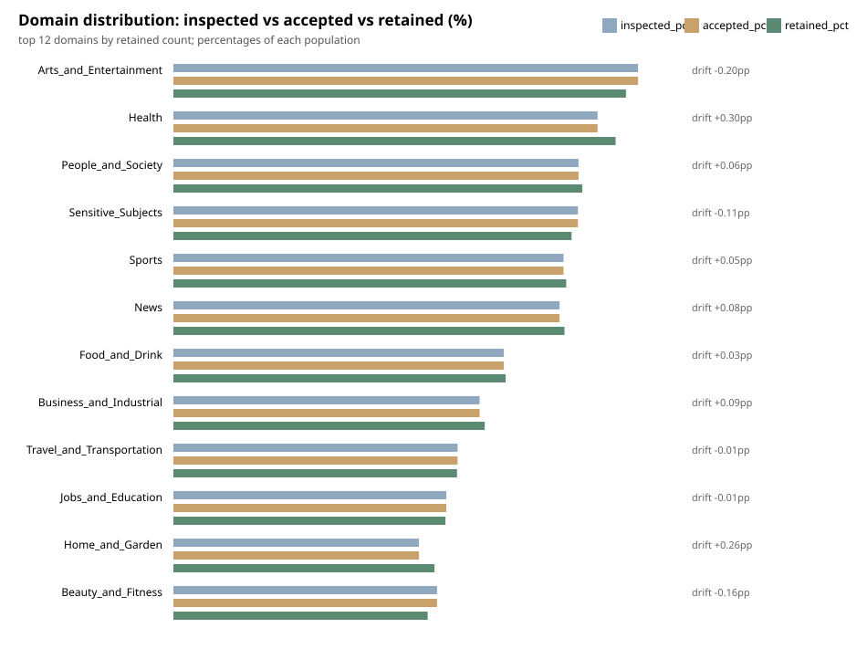
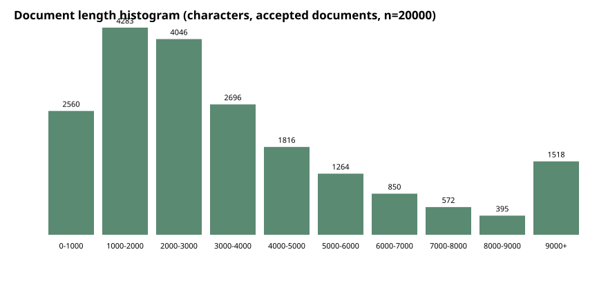

# Vietnamese NLP preprocessing pipeline

Pipeline streaming để làm sạch và chia tập văn bản tiếng Việt cho đồ án cuối kỳ CT219.

Pipeline giữ dấu tiếng Việt, cấu trúc đoạn và metadata truy vết.
Nó không tokenize, huấn luyện model hoặc tự động loại văn bản chỉ vì ngôn ngữ có vẻ lạ.

## Kết quả release 400k

| Chỉ số | Kết quả |
| --- | ---: |
| Văn bản nguồn đã duyệt | 12.169.131 |
| Văn bản được giữ | 400.000 |
| Văn bản bị loại | 31.810 |
| Tốc độ quét | 422,9 văn bản/giây |
| Trùng ID hoặc hash sau kiểm định | 0 |

Lần chạy mất khoảng 8 giờ, duyệt đủ 132 shard và khóa revision nguồn cùng commit của pipeline.
Manifest, checksum và round-trip JSONL đều khớp.

<table>
  <tr>
    <td></td>
    <td></td>
  </tr>
</table>

## Đầu ra

- Parquet và JSONL cho train, validation và test
- Stable split theo seed và document ID
- Exact deduplication trong RAM hoặc SQLite
- Statistics, manifest, checksums và revision dataset
- Quality audit chỉ đọc cùng review packet cho người kiểm tra

Dữ liệu được xử lý theo streaming, nên pipeline không cần nạp toàn bộ dataset vào RAM.

[Hướng dẫn chạy, cấu hình và giới hạn](GUIDE.md).

- [Data contract](docs/data_contract.md)
- [Báo cáo](docs/report.md)
- [Model handoff](docs/model_release_handoff.md)
